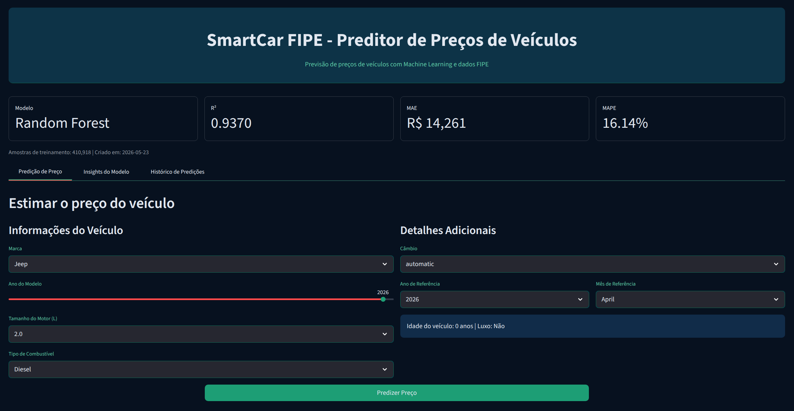
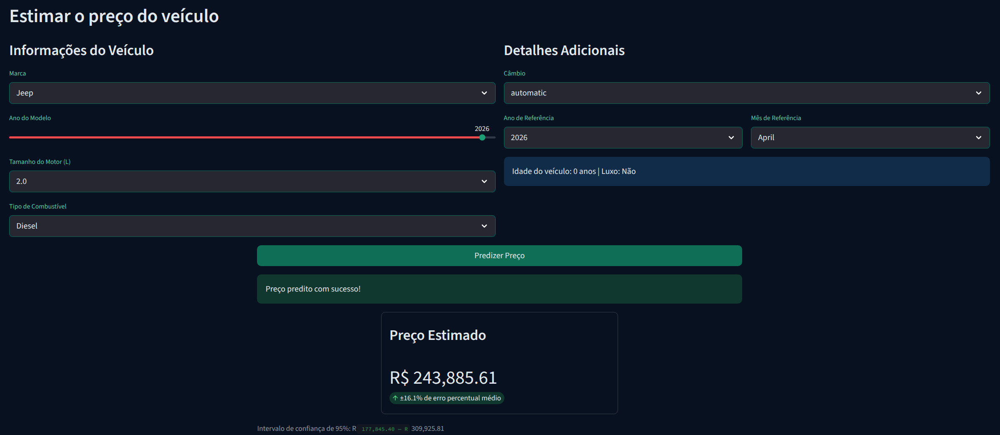
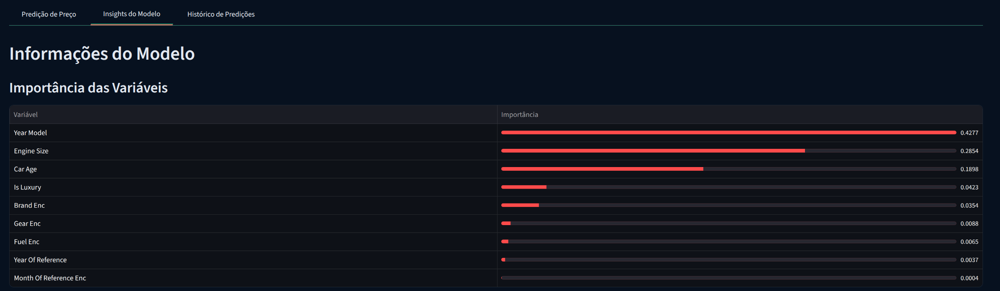
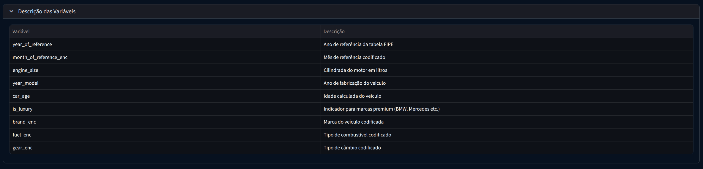
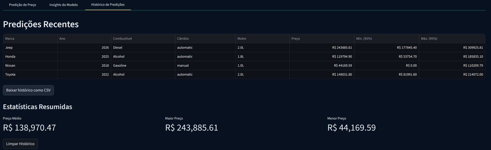

# SmartCar FIPE — Preditor de Preços de Veículos com Machine Learning

> Aplicação web interativa para estimativa de preços de veículos brasileiros com base na Tabela FIPE, desenvolvida com Python, Scikit-learn e Streamlit.

[](https://www.python.org/)
[](https://streamlit.io/)
[](https://scikit-learn.org/)
[](https://pandas.pydata.org/)
[](https://numpy.org/)
[]()

---

## Sumário

1. [Sobre o Projeto](#1-sobre-o-projeto)
2. [Objetivo](#2-objetivo)
3. [Sobre o Dataset](#3-sobre-o-dataset)
4. [Estrutura do Projeto](#4-estrutura-do-projeto)
5. [Variável Alvo](#5-variável-alvo)
6. [Variáveis Preditoras](#6-variáveis-preditoras)
7. [Metodologia](#7-metodologia)
8. [Modelos Treinados](#8-modelos-treinados)
9. [Melhor Modelo Selecionado](#9-melhor-modelo-selecionado)
10. [Métricas de Avaliação](#10-métricas-de-avaliação)
11. [Funcionamento da Aplicação](#11-funcionamento-da-aplicação)
12. [Tecnologias Utilizadas](#12-tecnologias-utilizadas)
13. [Como Executar o Projeto](#13-como-executar-o-projeto)
14. [Conclusão](#14-conclusão)

---

## 1. Sobre o Projeto

**Como preencher:**
- Descreva em 2 a 4 frases o contexto e a motivação do projeto.
- Responda: qual problema ele resolve? Para quem é útil?
- Mencione o domínio (ex.: mercado automotivo, saúde, finanças).

**Exemplo neste projeto:**

O SmartCar FIPE é um projeto de ciência de dados end-to-end aplicado ao mercado automotivo brasileiro. Ele utiliza dados históricos da Tabela FIPE para treinar um modelo de regressão capaz de estimar o preço médio de veículos a partir de suas características. O resultado é uma aplicação web interativa que permite a qualquer usuário obter uma estimativa de preço de forma rápida e intuitiva, sem necessidade de conhecimento técnico.

---

## 2. Objetivo

**Como preencher:**
- Escreva o objetivo geral em uma frase clara e direta.
- Liste de 2 a 4 objetivos específicos mensuráveis.
- Use verbos no infinitivo: desenvolver, treinar, avaliar, implementar.

**Exemplo neste projeto:**

**Objetivo geral:** Desenvolver um modelo preditivo de regressão para estimar o preço médio de veículos registrados na Tabela FIPE e disponibilizá-lo em uma interface web interativa.

**Objetivos específicos:**
- Treinar e comparar algoritmos de regressão sobre dados históricos da FIPE;
- Selecionar o modelo com melhor desempenho com base em métricas quantitativas;
- Serializar os arquivos do modelo para reaproveitamento em produção;
- Implementar uma aplicação Streamlit com formulário de entrada, resultado da predição e histórico de consultas.

---

## 3. Sobre o Dataset

**Como preencher:**
- Informe o nome, a fonte e a origem institucional dos dados.
- Indique se o arquivo é público, local ou institucional e seu caminho no projeto.
- Descreva o volume de dados e a divisão treino/validação/teste adotada.
- Explique o critério da divisão se não for aleatório simples.

**Exemplo neste projeto:**

Os dados utilizados provêm da **Tabela FIPE** (Fundação Instituto de Pesquisas Econômicas), referência oficial de precificação de veículos automotores no Brasil, com publicação mensal. O dataset consolida registros históricos com granularidade mensal e foi disponibilizado no projeto como arquivo local:

```text
data/fipe_cars.csv
```

| Partição | Registros |
|---|---|
| Treinamento | 410.918 |
| Validação | 88.054 |
| Teste | 88.055 |
| **Total** | **587.027** |

A divisão adotada foi **70/15/15**, estratificada por marca e ano de referência para garantir representatividade em todas as partições.

---

## 4. Estrutura do Projeto

**Como preencher:**
- Liste todos os arquivos e pastas do repositório.
- Adicione uma descrição curta ao lado de cada item.
- Indique quais arquivos não devem ser versionados no Git (dados brutos, modelos pesados).

**Exemplo neste projeto:**

```
smartcar-fipe/
│
├── app.py                    # Aplicação Streamlit (inferência e interface)
├── tabela_fipe_ml.ipynb      # Notebook de experimentação e treinamento
├── requirements.txt          # Dependências do projeto
├── README.md                 # Documentação do projeto
│
├── model/                    # Arquivos serializados do modelo
│   ├── melhor_modelo.pkl     # Modelo Random Forest treinado
│   ├── label_encoders.pkl    # Encoders das variáveis categóricas
│   ├── features.pkl          # Lista ordenada de features de entrada
│   └── metadata.json         # Metadados do treinamento e métricas
│
└── data/                     # Dados brutos
    └── fipe_cars.csv         # Dataset original da Tabela FIPE
```

> Os arquivos em `data/` e os `.pkl` em `model/` devem constar no `.gitignore` em repositórios públicos.

---

## 5. Variável Alvo

**Como preencher:**
- Informe o nome exato da coluna target no dataset.
- Descreva o que ela representa e sua unidade de medida.
- Indique se foi aplicada alguma transformação e justifique o motivo.

**Exemplo neste projeto:**

| Variável | Descrição | Unidade |
|---|---|---|
| `avg_price_brl` | Preço médio de referência do veículo na Tabela FIPE | Reais (R$) |

**Transformação aplicada:** `log1p(avg_price_brl)` durante o treinamento, revertida com `expm1` na inferência.

A transformação logarítmica foi necessária porque preços de veículos apresentam distribuição fortemente assimétrica à direita — veículos de luxo com valores muito elevados distorcem a função de perda. O `log1p` comprime essa cauda, aproxima o target de uma distribuição normal e reduz o peso desproporcional de outliers.

---

## 6. Variáveis Preditoras

**Como preencher:**
- Liste todas as features usadas como entrada no modelo em uma tabela.
- Informe o tipo (numérica, categórica, binária), a origem (direta, derivada, codificada) e uma descrição curta.
- Se alguma feature foi criada artificialmente, explique como.

**Exemplo neste projeto:**

| Feature | Tipo | Origem | Descrição |
|---|---|---|---|
| `year_of_reference` | Numérica | Direta | Ano da tabela FIPE consultada |
| `month_of_reference_enc` | Numérica | Codificada | Mês de referência via LabelEncoder |
| `engine_size` | Numérica | Direta | Cilindrada do motor em litros |
| `year_model` | Numérica | Direta | Ano de fabricação do veículo |
| `car_age` | Numérica | Derivada | `year_of_reference − year_model` |
| `is_luxury` | Binária | Derivada | 1 para BMW, Mercedes-Benz, Audi, Porsche, Land Rover; 0 caso contrário |
| `brand_enc` | Numérica | Codificada | Marca do veículo via LabelEncoder |
| `fuel_enc` | Numérica | Codificada | Tipo de combustível via LabelEncoder |
| `gear_enc` | Numérica | Codificada | Tipo de câmbio via LabelEncoder |

**Features derivadas criadas no projeto:**
- `car_age`: calculada subtraindo o ano de fabricação do ano de referência da consulta FIPE. Representa a depreciação temporal do veículo.
- `is_luxury`: flag binária baseada em heurística de marcas premium. Captura um padrão de precificação que não estaria disponível apenas no `brand_enc`.

---

## 7. Metodologia

**Como preencher:**
- Descreva cada etapa do pipeline de ML em ordem sequencial.
- Justifique decisões não óbvias (transformações, escolhas de encoding, critério de divisão).
- Um diagrama ou lista numerada é suficiente; não é necessário código nesta seção.

**Exemplo neste projeto:**

```
Dados brutos (fipe_cars.csv)
        │
        ▼
1. Limpeza e tratamento de valores ausentes
        │
        ▼
2. Engenharia de features
   ├── car_age  =  year_of_reference - year_model
   └── is_luxury  =  indicador binário para marcas premium
        │
        ▼
3. Codificação de variáveis categóricas
   └── LabelEncoder para brand, fuel, gear, month_of_reference
        │
        ▼
4. Transformação logarítmica do target
   └── log1p(avg_price_brl)
        │
        ▼
5. Divisão dos dados: 70% treino / 15% validação / 15% teste
        │
        ▼
6. Treinamento com validação cruzada (5 folds)
        │
        ▼
7. Comparação e seleção do melhor modelo (critério: R² na validação)
        │
        ▼
8. Avaliação final no conjunto de teste (hold-out)
        │
        ▼
9. Serialização dos arquivos com joblib
```

---

## 8. Modelos Treinados

**Como preencher:**
- Liste todos os algoritmos avaliados durante a experimentação.
- Para cada um, indique brevemente seu papel na comparação (baseline, modelo principal, alternativa).
- Não é necessário listar hiperparâmetros aqui; isso vai no notebook.

**Exemplo neste projeto:**

| Algoritmo | Papel na Comparação |
|---|---|
| Linear Regression | Baseline linear interpretável |
| Ridge Regression | Modelo linear com regularização L2 |
| Lasso Regression | Modelo linear com regularização L1 |
| ElasticNet | Modelo linear com combinação de regularizações L1 e L2 |
| Decision Tree Regressor | Modelo não linear simples baseado em árvore |
| Random Forest Regressor | Ensemble por bagging e modelo final selecionado |
| Extra Trees Regressor | Ensemble baseado em árvores extremamente aleatórias |
| Gradient Boosting Regressor | Ensemble sequencial por boosting |
| XGBoost Regressor | Modelo de boosting avançado |
| LightGBM Regressor | Modelo de boosting avançado otimizado |

Todos os modelos foram avaliados com validação cruzada sobre o conjunto de treinamento, usando R² como critério de comparação.

---

## 9. Melhor Modelo Selecionado

**Como preencher:**
- Informe qual modelo foi selecionado e por quê.
- Cite os critérios objetivos usados na decisão (métrica, estabilidade, ausência de overfitting).
- Se aplicável, mencione os principais hiperparâmetros utilizados.

**Exemplo neste projeto:**

**Modelo selecionado: Random Forest Regressor**

O Random Forest foi selecionado por apresentar o maior R² no conjunto de validação entre todos os algoritmos avaliados, combinado com baixa variância entre os folds da validação cruzada — indicativo de boa generalização. Não foram observados sinais relevantes de overfitting na comparação entre desempenho de treino e validação.

| Critério de Seleção | Resultado |
|---|---|
| Melhor R² na validação | Sim |
| Estabilidade entre folds | Alta |
| Overfitting identificado | Não |

Os arquivos do modelo treinado estão serializados em:

```text
model/melhor_modelo.pkl
```

---

## 10. Métricas de Avaliação

**Como preencher:**
- Liste cada métrica com sua fórmula e interpretação prática.
- Explique o que "melhor" significa para cada uma (maior ou menor).
- Se a aplicação usa alguma métrica derivada (ex.: intervalo de confiança), documente e seus pressupostos.

**Exemplo neste projeto:**

Métricas calculadas sobre o **conjunto de teste** (88.055 registros, hold-out):

| Métrica | Resultado | O que mede | Como interpretar no contexto do projeto |
|---|---:|---|---|
| **R²** | **0,9370** | Proporção da variação dos preços reais explicada pelo modelo. | O modelo explica aproximadamente **93,7% da variação dos preços** no conjunto de teste. Quanto mais próximo de 1, melhor. |
| **MAE** | **R$ 14.260,80** | Erro médio absoluto entre preço real e preço previsto. | Em média, as previsões ficaram cerca de **R$ 14,3 mil distantes do preço real**. Quanto menor, melhor. |
| **RMSE** | **R$ 33.693,98** | Erro médio com maior penalização para erros grandes. | Como o RMSE é maior que o MAE, há casos com erros mais elevados, possivelmente em veículos mais caros ou menos frequentes. Quanto menor, melhor. |
| **MAPE** | **16,14%** | Erro percentual médio entre preço real e preço previsto. | Em média, o modelo apresentou erro de aproximadamente **16,14% em relação ao preço real**. Quanto menor, melhor. |

**Faixa estimada na aplicação:** indica uma variação aproximada em torno do preço previsto, baseada no erro médio do modelo. Deve ser interpretada como referência auxiliar de incerteza, não como intervalo estatístico formal.

---

## 11. Funcionamento da Aplicação

**Como preencher:**
- Descreva cada tela ou aba da aplicação em uma subseção.
- Insira prints reais da aplicação funcionando.
- Explique o que o usuário faz em cada tela e o que o sistema retorna.

**Exemplo neste projeto:**

https://github.com/user-attachments/assets/2d61c8ff-8115-4f52-9390-8753566c3af3

A aplicação é organizada em três abas acessíveis pelo menu superior.

---

### Aba 1 — Predição de Preço

O usuário preenche as características do veículo, como marca, ano, motor, combustível, câmbio, ano e mês de referência, e clica em **Estimar Preço**. A aplicação retorna o preço estimado em reais com uma faixa estimada aproximada de variação.




---

### Aba 2 — Insights do Modelo

Exibe a importância das variáveis calculada pelo Random Forest, as métricas de desempenho do modelo e um dicionário expandível com a descrição de cada feature.





---

### Aba 3 — Histórico de Predições

Acumula todas as predições realizadas na sessão em uma tabela com marca, ano, combustível, câmbio, motor, preço estimado e faixa estimada aproximada. Permite exportar o histórico como CSV e exibe estatísticas descritivas, como preço médio, maior e menor valor, quando há mais de uma predição registrada.



---

## 12. Tecnologias Utilizadas

**Como preencher:**
- Liste as tecnologias agrupadas por categoria (linguagem, ML, interface, utilitários).
- Informe a versão mínima exigida de cada dependência principal.
- Não é necessário listar dependências transitivas.

**Exemplo neste projeto:**

| Categoria | Tecnologia | Versão Mínima |
|---|---|---|
| Linguagem | Python | 3.10 |
| Interface web | Streamlit | 1.28 |
| Machine Learning | Scikit-learn | 1.2 |
| Manipulação de dados | Pandas | 1.5 |
| Computação numérica | NumPy | 1.23 |
| Serialização de modelos | Joblib | 1.2 |

---

## 13. Como Executar o Projeto

**Como preencher:**
- Liste os pré-requisitos de ambiente (versão do Python, sistema operacional se relevante).
- Forneça os comandos exatos em ordem, do clone à execução.
- Indique como regenerar os arquivos do modelo se necessário.

**Exemplo neste projeto:**

**Pré-requisito:** Python 3.10 ou superior instalado.

```bash
# 1. Clone o repositório
git clone https://github.com/seu-user/smartcar-fipe.git
cd smartcar-fipe

# 2. Crie e ative o ambiente virtual
python -m venv venv
source venv/bin/activate        # Linux/macOS
# venv\Scripts\activate         # Windows

# 3. Instale as dependências
pip install -r requirements.txt

# 4. Execute a aplicação
streamlit run app.py
```

A aplicação estará disponível em `http://localhost:8501`.


> Caso os artefatos em `model/` não existam, execute o notebook `tabela_fipe_ml.ipynb` com o dataset em `data/fipe_cars.csv` para regenerá-los antes de iniciar a aplicação.

---

## 14. Conclusão

**Como preencher:**
- Retome o objetivo do projeto e indique se foi alcançado.
- Destaque os principais resultados obtidos (métrica principal, feature mais relevante).
- Aponte de 2 a 3 limitações conhecidas do projeto atual.
- Sugira de 2 a 3 extensões concretas e tecnicamente viáveis como trabalho futuro.

**Exemplo neste projeto:**

O projeto atingiu seu objetivo ao entregar um modelo de regressão com R² de 0,937 e erro percentual médio de 16,14% — desempenho considerado satisfatório dado que o dataset abrange desde veículos populares abaixo de R$ 20.000 até modelos de luxo acima de R$ 500.000, uma amplitude superior a 25 vezes. A feature mais relevante identificada pelo Random Forest foi `year_model` (importância: 0,4277), seguida de `engine_size` (0,2854) e `car_age` (0,1898), o que é coerente com a dinâmica de depreciação do mercado automotivo brasileiro.

**Limitações:**
- O modelo foi treinado com dados até 2023; estimativas para anos posteriores extrapolam a distribuição de treinamento;
- A flag `is_luxury` é uma heurística de cinco marcas fixas;

**Trabalhos futuros:**
- Substituir `LabelEncoder` por `TargetEncoder` para variáveis de alta cardinalidade como `brand`;
- Adicionar explicabilidade local por predição com SHAP (*SHapley Additive exPlanations*);
- Experimentar modelos de gradient boosting (XGBoost, LightGBM) com tuning de hiperparâmetros via Optuna.

---

*Projeto desenvolvido como material didático de apoio, 2026.*
